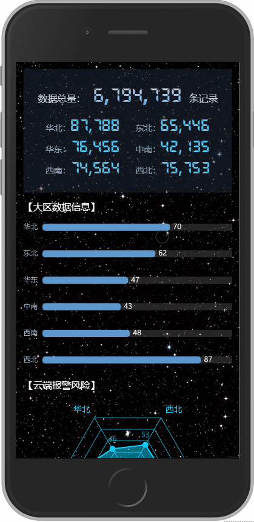
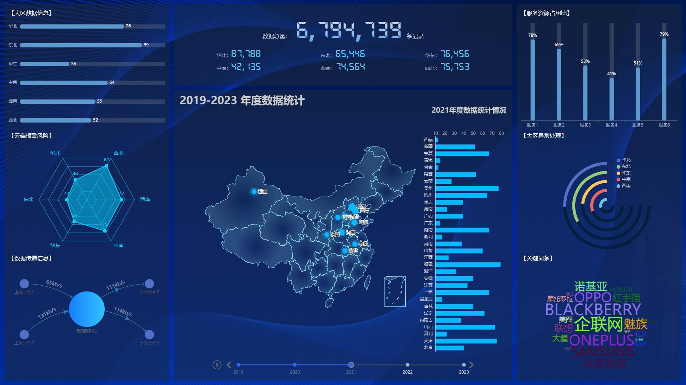

# 怪咖大数据平台

#### new---变异版本-移动版
> Time 2023-12-14
- 新增移动版，根窗口适配PC和移动版，只是做了简单的优化；
- 去除了可视化地图（移动端显示不全）；
- 新增了路由模块



#### 介绍
数据可视化大屏

本人想`“砖研”`可视化大屏已久，无奈没找到合适的资源（懒），曾用`html+css+jquery+echarts，vue + datav`敲了一些示例，布局真是让人头疼


一个偶然的机会，看到程序员 `Sunday老师` 的视频，瞬间开启新大陆

项目是基于 `Vue 3 + Vite 4 + ECharts 5 + Tailwindcss`开发的可视化项目

跟着 `Sunday 老师` 的视频一步一步敲出来（代码搬运工）

在这里再次感谢程序员 `Sunday 老师`的无私奉献，链接附上↓


[2023 最新：ECharts 数据可视化大屏项目](https://www.bilibili.com/video/BV1yu411E7cm?p=1&vd_source=4c524e8e506ca061863d2041deba2db8)

#### 软件架构
```html
Vue3.2 + Vite 4 + ECharts 5 + Tailwindcss
```
[Tailwindcss](https://www.tailwindcss.cn)

#### 安装教程

```js
npm install
```

#### 使用说明

```js
npm run dev
```

#### 演示效果

本地部署地址：[http://gk.datav.com:89](http://gk.datav.com:89)

演示地址：[https://www.guaika.xyz](https://www.guaika.xyz)




博客地址: [怪咖工作室](https://www.wbdqc.cn)

<span style="color:red;">如果你也觉得有趣，就点个star吧 🙏</span>
